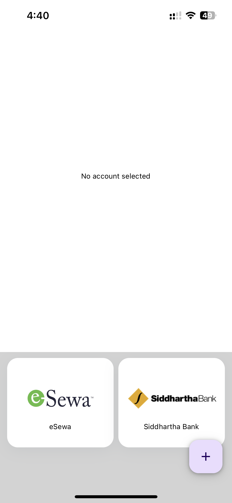

# QR Share Application

## Description

This application has been designed to take banking and mobile wallet QR codes and store all of them inside the same application. This application intends to remove the necessity of opening multiple applications from different banks/wallets to show the QR codes.

## Features

- Scan QR codes and add them to the application
- Show QR codes
- Delete QR codes
- Edit QR codes
- Add QR codes manually

## Screenshots

||||
|---|---|---|
||||
|| | |
